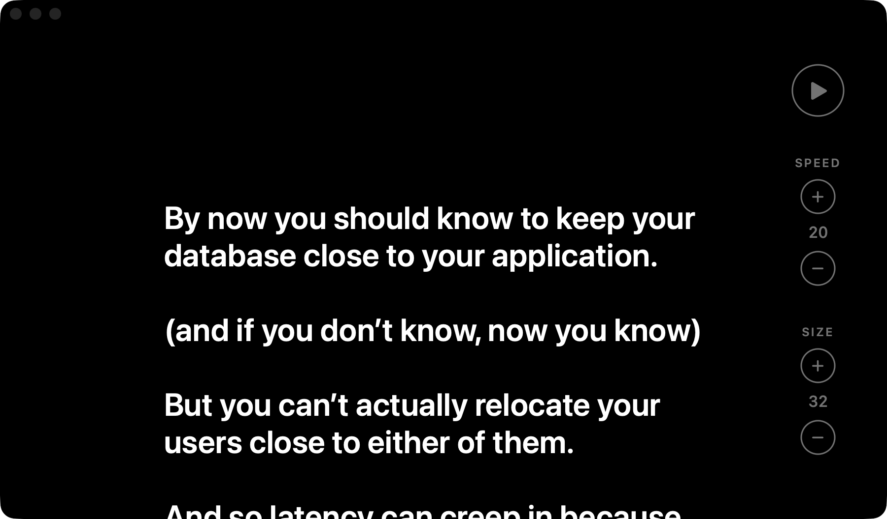

<p align="center">
  
</p>

# Prompty

A minimal native macOS teleprompter. Pure black background, large white text, nothing else.



## Features

- Paste or type plain text into the centre column
- Line length capped at roughly 40 characters so your eyes don't travel far
- Smooth auto-scroll with adjustable speed
- Adjustable text size
- Speed and size controls fade away while playing
- Text, speed and size are remembered between launches

## Keyboard shortcuts

| Action        | Shortcut  |
| ------------- | --------- |
| Play / pause  | ⌘ Return  |
| Faster        | ⌘ ↑       |
| Slower        | ⌘ ↓       |
| Larger text   | ⌘ =       |
| Smaller text  | ⌘ −       |

## Building

Requires macOS 14 or later and Xcode 26 or later (for the Icon Composer `.icon` file).

```sh
./build-app.sh
open build/Prompty.app
```

The script builds a release binary with Swift Package Manager, compiles `Prompty.icon`, and assembles an ad-hoc signed `build/Prompty.app`. Copy it to `/Applications` if you want to keep it.

## Project layout

```
Sources/Prompty/   SwiftUI app source
Prompty.icon/      App icon (open in Icon Composer)
docs/images/       README assets
build-app.sh       Builds build/Prompty.app
```
